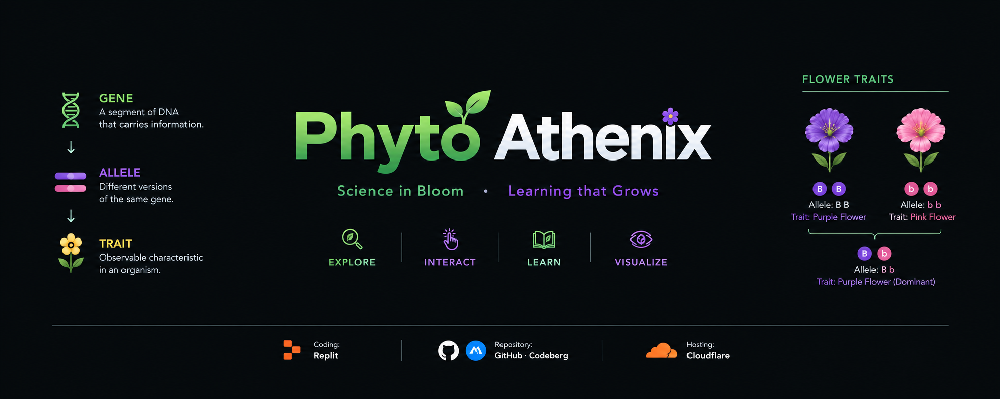

  

# 🧬 Phyto Athenix

### *Interactive DNA, Gene & Trait Simulator*

> **Phyto Athenix** is an interactive visualization exploring **DNA, genes, chromosomes, and their relationship to observable traits**.
>
> 🧬 **Genetics** · 🧪 **DNA** · 🌱 **Traits**

**🔬 [Explore the Simulation](https://phyto-athenix-api-server-git-main-draven-s-six-paths.vercel.app/
)**

---

## ✦ Features

**🧬 Interactive Genetics**  
Explore relationships between DNA, genes, chromosomes, and observable traits.

**🔬 Scientific Visualization**  
Visualize genetic organization and how genetic information contributes to observable characteristics.

**📚 Educational Focus**  
Explore fundamental genetics concepts with an emphasis on scientific accuracy and conceptual clarity.

**📱 Responsive Design**  
Optimized for modern desktop, tablet, and mobile devices.

---

## 🧬 Core Concepts

**DNA · Genes · Chromosomes · Genetic Information · Gene Expression · Observable Traits**

---

## ⚙️ Technology

**React · TypeScript · HTML · CSS**

**Repository:** GitHub & Codeberg  
**Hosting:** Vercel

---

## 📜 License

Distributed under the **GNU General Public License v3.0 (GPL-3.0)**.
